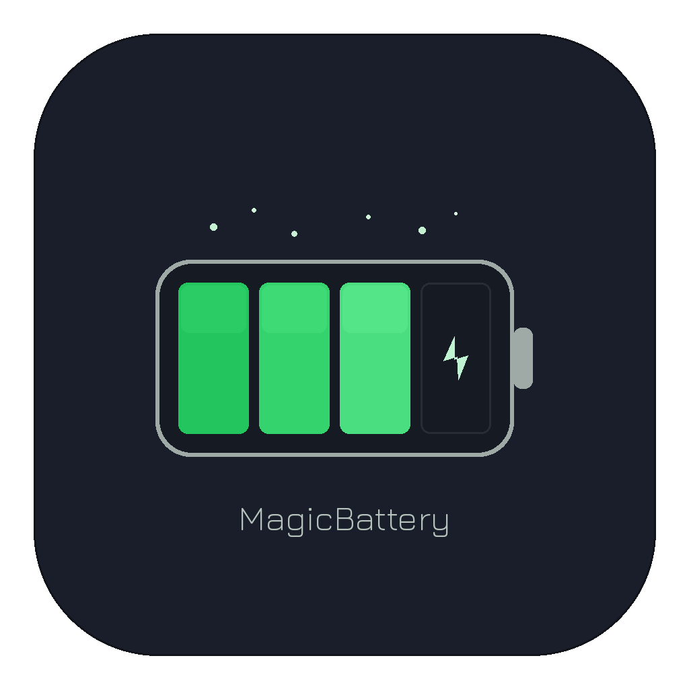

# MagicBattery

A lightweight macOS menu bar app that displays battery levels for your Magic Keyboard, Magic Mouse, and Magic Trackpad.



## Install

Requires **macOS 14+** and **Xcode Command Line Tools** (`xcode-select --install`).

```bash
git clone https://github.com/ThomasMary40/magicBattery.git && cd magicBattery && bash install.sh
```

This builds the app, copies it to `/Applications`, adds it to your login items, and launches it.

## What it does

- Shows battery percentages in the menu bar: `⌨ 67% 🖱 12%`
- Click to see a dropdown with device names and color-coded levels
- Auto-refreshes every 60 seconds
- Starts automatically on boot
- No Dock icon — lives only in the menu bar

## Uninstall

```bash
rm -rf /Applications/MagicBattery.app
osascript -e 'tell application "System Events" to delete login item "MagicBattery"'
```

## Build from source

```bash
bash build.sh
open build/MagicBattery.app
```

## License

MIT
